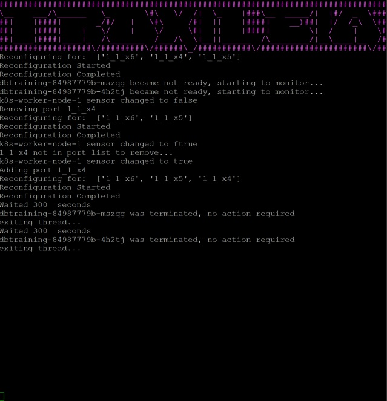

Troxileia
=========

Troxileia is a Kubernetes controller that reconfigures a network tap if pods are consistently crashing on a node and/or if "sensor" label on a node is changed from true to false. Troxileia is designed to be used with sensors like Zeek, Moloch, and Suricata. It assures that the load balancing being done by the tap is consistent with the current state of the cluster.



Requirements
============

Kubernetes (tested on 1.15)

Python 3.0+ (If ran locally)

Python Kubernetes library (If ran locally)
```
pip install kubernetes
```
How to Use
==========

Troxileia can be run locally outside of the cluser or as its own pod inside the cluser. To use, all nodes need a "port" label and nodes you intend to monitor should have a sensor label:

```
#Kubernetes does not accept "/", change them to "_" in port name:
kubectl label nodes k8s-worker-1 port="1_1_x1"
kubectl label nodes k8s-worker-1 sensor="true"
```
The sensor label can be left off and added later, or initially set to false if they may be monitored later.

First the variables in troxileia-configmap.yaml and troxileia-secrets.yaml must be set. Edit those to match your setup. The secret file contains the username and password for the tap. These values must be passed in as base_64.
Then the configmap must be applied to the cluser:
```
kubectl apply -f troxileia-configmap.yaml
kubectl apply -f troxileia-secret.yaml
```
To get rid of plain-text username and password stored in secret yaml file:
```
rm troxileia-secret.yaml
```
If using RBAC, give proper permissions:

```
kubectl create clusterrolebinding troxileiaClusterRoleBinding --clusterrole=cluster-admin --serviceaccount=kube-system:default
```
### To run locally:
```
python main.py
```


### To deploy as a pod in cluster in kube-system namespace:

```
kubectl apply troxileia.yaml
```
